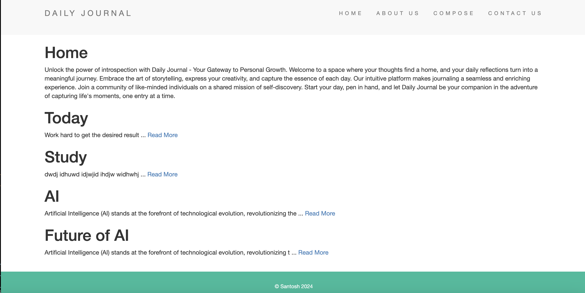
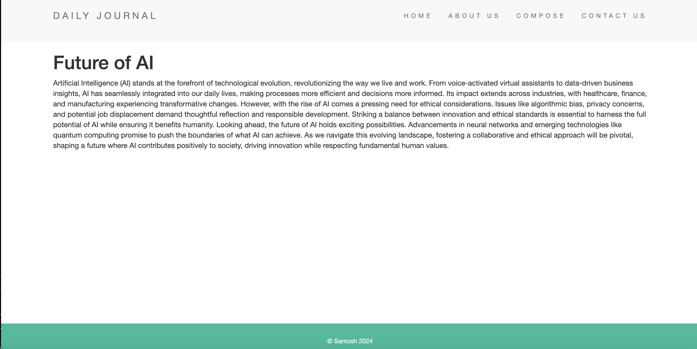
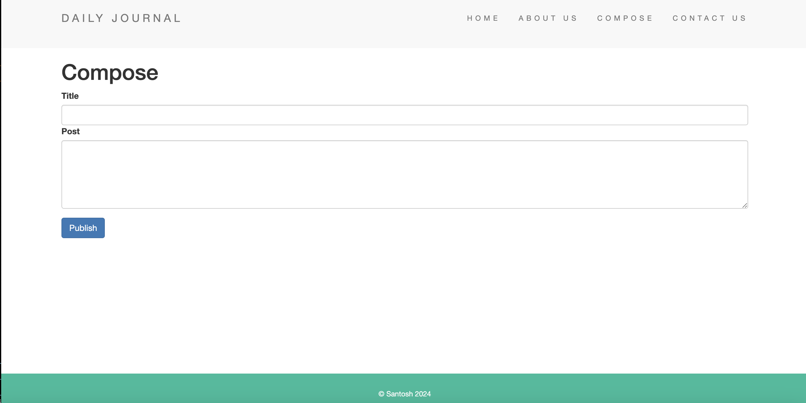

# Blog with database

## Stack
- Node, EJS, MongoDB, CSS, Bootstrap

## Screenshots

### About website
- Home, about, compose and contact route.
- User can make a new blog from the compose tab.
- The sucessfully posted blogs render in the home page also the posting blog redirect user to homepage.
- The blog content in the homepage limited to certain characters.
- The read more option in the content of each blog navigates to the individual page with the blog title and full content.
- The contact section has some text and simple form.